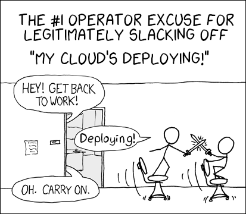

# Words, words, words...

A Director (aka [Tripleo][]) deployment starts with an *undercloud* that is then used to deploy an *overcloud*.

[tripleo]: https://docs.openstack.org/tripleo-docs/latest/

# What's an overcloud?

The *overcloud* is your "production" [OpenStack][] cluster (the OpenStack environment with which you or your customers will interact).

# What's an Undercloud?

The *undercloud* is a highly opinionated, single-node deployment of [OpenStack][].

- [Ironic][] to manage the baremetal hardware
- A collection ([Heat][], [Mistral][], [Zaqar][], [Nova][], ...) of other OpenStack services to drive the installation process
- [Ansible][] to orchestrate actions on the overcloud hosts
- [Puppet][] to apply the configuration

[openstack]: https://www.openstack.org/
[ironic]: https://docs.openstack.org/ironic/latest/
[ansible]: https://www.ansible.com/
[puppet]: https://puppet.com/
[heat]: https://docs.openstack.org/heat/latest/
[mistral]: https://docs.openstack.org/mistral/latest/
[zaqar]: https://docs.openstack.org/zaqar/latest/
[nova]: https://docs.openstack.org/nova/latest/

# Deployment overview

First:

- Install the undercloud

Repeat as necessary:

- Configure your overcloud deployment
- Deploy the overcloud

# Installing the undercloud

- Install the `python-tripleoclient` package
- Prepare container images by running `openstack tripleo container image prepare ...`
- Configure `undercloud.conf` as necessary
- Run `openstack underlcoud install`

# TL;DR

```
sudo yum -y install python-tripleoclient
openstack tripleo container image prepare default ...
openstack undercloud install
```

# Undercloud configuration for this demo

```
[DEFAULT]
container_images_file = containers-prepare-parameter.yaml
custom_env_files = containers-prepare-credentials.yaml
local_interface = eth1
[ctlplane-subnet]
masquerade = true
```

# Container images

- OSP 15 runs containerized OpenStack services on both the *undercloud* and the *overcloud*.
- The use of Docker in previous releases has been replaced by [Podman][].
- The `container image prepare` step downloads images from a remote registry and stuffs
  them into a local registry (for speed and reliability during deploys)

[podman]: https://podman.io/

# Customizing container images

Tripleo provides hooks for customizing container image:

- Package upgrades
- Additional package installations
- Build from custom Dockerfile

# Preparing for the overcloud install

- Upload baremetal images to glance
- Register baremetal nodes
- Introspect baremetal nodes
- Assign roles to baremetal nodes
- Configure environment files
- Run `openstack overcloud deploy`

# Uploading baremetal images

The overcloud images are provisioned by Ironic onto the baremetal nodes.

- `bm-deploy-kernel`
- `bm-deploy-ramdisk`
- `overcloud-full`
- `overcloud-full-initrd`
- `overcloud-full-vmlinuz`

# Register baremetal nodes

Ironic needs to know what nodes are available and how to control them.

- `openstack overcloud node import` reads a JSON file (`nodes.json`)
  describing available nodes.
- Provides IPMI credentials and MAC address of PXE interface

##

```
[
  {
    "pm_password": "password",
    "name": "compute-0",
    "pm_addr": "192.168.122.1",
    "mac": [
      "52:54:00:8f:30:7b"
    ],
    "pm_port": 6233,
    "pm_type": "ipmi",
    "pm_user": "admin"
  },
  ...
```

# Introspect baremetal nodes

Boot an ironic inspector image on the baremetal nodes to perform hardware discovery.

- Some information is exposed as node properties, where it can be used for
  node selection

## Viewing introspection data

You can view introspection data by running:

```
openstack baremetal introspection data save <node_name_or_id>
```

# Assign roles to baremetal nodes

Tag nodes with a profile property that is used to match them to a specific role.

```
openstack baremetal node set \
  --property capabilities='profile:controller,boot_option:local' <node_name_or_id>
```

## Node profiles are matched by flavors

```
+------------+-------------------------+
| Field      | Value                   |
+------------+-------------------------+
| properties | capabilities:profile='c |
|            | ontrol', resources:CUST |
|            | OM_BAREMETAL='1',       |
|            | resources:DISK_GB='0',  |
|            | resources:MEMORY_MB='0' |
|            | , resources:VCPU='0'    |
+------------+-------------------------+
```

# Configure environment files

Installation configuration is provided primarily in the form of *environment files*. An environment file may have either (or both) of two sections:

- `resource_registry`
- `parameter_defaults`

# resource registry

The `resource_registry` section maps Heat resource names to implementations.

## resource_registry example

```
---
resource_registry:
  OS::TripleO::Controller::Net::SoftwareConfig: network-controller.yaml
  OS::TripleO::Compute::Net::SoftwareConfig: network-compute.yaml
```

# Parameter defaults

The `parameter_defaults` section sets variable used in the deployment process.

## parameter_defaults example

```
---
parameter_defaults:
  TimeZone: US/Eastern
  ExtraConfig:
    tripleo::firewall::firewall_rules:
      '050 allow ssh from virthost':
        source: 192.168.122.0/24
        port: 22
        proto: tcp
        action: accept
```

# Running the overcloud install



# The overcloud deploy command

Start the deploy with the `openstack overcloud deploy` command.

- You must always specify the same environment files and other options.
- Put this command in a script. Never run it by hand.
